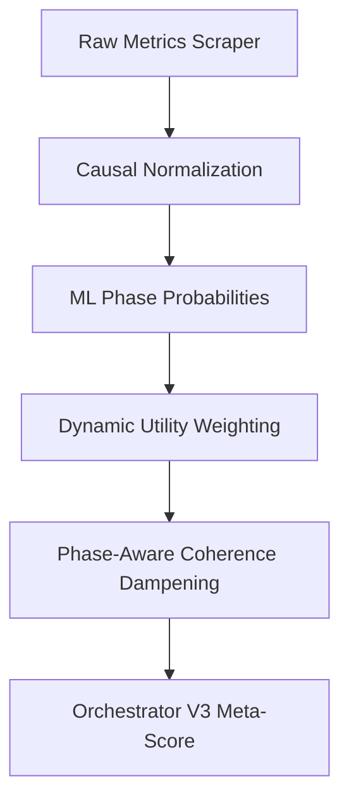

# BitcoinScore V3.2ML: Master Technical & Financial Documentation

BitcoinScore V3.2ML is a lookahead-free, machine-learning-enhanced Buy Risk Index (0–100 scale) calibrated specifically for macro crypto traders. It measures Bitcoin buy opportunity by blending multi-source indicators (on-chain capitulation, technical analysis, macro liquidity, sentiment, and spot ETF flows) with continuous ML-driven phase classification and dynamic utility weight tuning.

---

## 1. Core Architecture

The system evaluates risk through a 5-stage pipeline:

### Stage 1: Causal Point-in-Time Normalization
To prevent lookahead bias during backtesting and live runs, all metrics are normalized to a uniform `0-100` scale using causal percentile ranks.
- Historical data is loaded only up to the target date.
- For adaptive metrics (`nupl`, `mvrv_z_score`, `cvdd_ratio`, `mayer_multiple`), a rolling 4-year window is utilized to compute the percentile rank of the current value.
- The final score is a blend (50/50 default) of this rolling percentile rank and a fixed mathematical mapping.

### Stage 2: ML-Driven Phase Detection
The market's regime is classified continuously using a regularized Logistic Regression model trained on historical data.
- **Features**: A 22-dimensional wave vector consisting of the current normalized values of 11 indicators and their 11-day lookback deltas (capturing momentum).
- **Outputs**: Continuous probability weights for the three regimes:
  - $w_{\text{bot}}$ (probability of `BOTTOM` phase)
  - $w_{\text{top}}$ (probability of `TOP` phase)
  - $w_{\text{neutral}}$ (probability of `NEUTRAL` phase)
  
*Implementation: [train_v3_phase_model.py](file:///Users/max/BitcoinScore/tools/train_v3_phase_model.py)*

### Stage 3: Dynamic Utility Weights
Metrics do not have static weights. Instead, each metric has a relevance profile determining its utility coefficient $U_i \in [0.1, 1.0]$ based on the active phase:
$$U_i = w_{\text{top}} \times \text{Profile}_i[\text{TOP}] + w_{\text{bot}} \times \text{Profile}_i[\text{BOTTOM}] + w_{\text{neutral}} \times \text{Profile}_i[\text{NEUTRAL}]$$

- During a bottom, on-chain metrics like `cvdd_ratio` or `nupl` gain maximum utility ($1.0$), while macro and technical indicators are heavily suppressed to prevent volatility from skewing the entry signals.
- During a top, technical oscillators (`cipherb`), sentiment (`fear_greed`), and trend deviations (`mayer_multiple`) gain maximum utility.

*Implementation: [utility_evaluator.py](file:///Users/max/BitcoinScore/scraper/utility_evaluator.py)*

### Stage 4: Phase-Aware Coherence Dampening
When on-chain metrics diverge (high standard deviation among indicators), the score is pulled towards a phase-appropriate target instead of a fixed 50:
- **`BOTTOM` Phase Target**: **30** (ensures score remains in buy range even with minor metric deviations).
- **`TOP` Phase Target**: **70** (ensures score remains in warning/sell range).
- **`NEUTRAL` Phase Target**: **50**.

Coherence factor $C \in [0, 1]$ is calculated based on on-chain dispersion:
$$\text{final\_score} = \text{target} + (\text{raw\_avg} - \text{target}) \times C$$

*Implementation: [scoring_v3.py](file:///Users/max/BitcoinScore/scraper/scoring_v3.py)*

### Stage 5: Orchestrator V3 Integration
The Orchestrator blends the dynamic V3.1ML score with the Wave Resonance (WR) vector:
- **Agreement Mapping**: Continuously calculates directional vector alignment between the V3.1ML score trend and WR.
- **Conviction Pulls**: Pulls the score towards the extreme buy/sell zones when there is high agreement.
- **Regime Flagging**: Generates actionable flags: `CONFIRMED_BOTTOM`, `PROBABLE_BOTTOM`, `NEUTRAL`, `PROBABLE_TOP`, `CONFIRMED_TOP`.

*Implementation: [orchestrator.py](file:///Users/max/BitcoinScore/scraper/orchestrator.py)*

---

## 2. Weight Optimization Framework

The weight profiles are calibrated using a **Trader-focused coordinate descent optimizer**. It optimizes parameters to maximize a fitness function representing a successful macro trader strategy.

### Trader Strategy Rules
- **Buy/Accumulate**: Risk index $\le 30$.
- **Sell/Distribute**: Risk index $\ge 75$.
- **Hold**: Between 30 and 75.

### Objective Function
The optimizer minimizes a compound loss function:
$$\text{Loss} = -1.0 \times \text{Return (\%)} + 4.0 \times \text{Max Drawdown (\%)} + 0.25 \times \text{MSE} + \text{Hinge Loss}$$

Where:
- **Return & Drawdown**: Computed from a full historical simulation of the trader's strategy (starting with $10,000 cash).
- **MSE**: Weighted mean squared error against the 6-month returns target to maintain a smooth curve.
- **Hinge Loss**: Penalizes wrong classifications at critical market turning points (Milestones):
  - Bottom dates (`2018-12-15`, `2020-03-13`, `2022-06-18`, `2022-11-21`): Penalty if score $> 20$.
  - Top dates (`2021-04-14`, `2021-11-10`, `2024-03-14`, `2025-01-20`, `2025-09-29`): Penalty if score $< 80$.

*Implementation: [optimize_v3_relevance.py](file:///Users/max/BitcoinScore/tools/optimize_v3_relevance.py)*

---

## 3. Backtest Milestone Performance

A comparison of historical cycle pivot points demonstrates the precision of the V3.2 calibration:

| Milestone Date | Label | BTC Price | V3.2 Score | Active Zone |
| :---: | :--- | :---: | :---: | :---: |
| **2018-12-15** | 2018 Cycle Bottom | $3,200 | **25** | BOTTOM (Buy) |
| **2020-03-13** | COVID Crash | $3,800 | **26** | BOTTOM (Buy) |
| **2022-06-18** | Capitulation | $17,600 | **24** | BOTTOM (Buy) |
| **2022-11-21** | FTX Bottom | $15,500 | **27** | BOTTOM (Buy) |
| **2021-04-14** | Spring ATH | $63,500 | **88** | TOP (Sell) |
| **2021-11-10** | Nov 2021 ATH | $69,000 | **80** | TOP (Sell) |
| **2024-03-14** | 2024 ATH | $73,500 | **82** | TOP (Sell) |
| **2025-07-17** | CB Weekly Peak | $118,735 | **80** | TOP (Sell) |
| **2026-06-14** | Today's Valuation | $64,279 | **32** | NEUTRAL (Hold/DCA) |

*Verifiable via: [backtest.py](file:///Users/max/BitcoinScore/tools/backtest.py) & [analyze_bottoms.py](file:///Users/max/BitcoinScore/scratch/analyze_bottoms.py)*

---

## 4. Codebase Directory Map

- **Core Scoring Logic**:
  - [scoring_v3.py](file:///Users/max/BitcoinScore/scraper/scoring_v3.py): Composite index construction, normalization wrapper, and phase-aware coherence dampening.
  - [utility_evaluator.py](file:///Users/max/BitcoinScore/scraper/utility_evaluator.py): Evaluates continuous utility coefficients based on weights.
  - [orchestrator.py](file:///Users/max/BitcoinScore/scraper/orchestrator.py): Blends V3.1ML score and Wave Resonance into a Meta-Score.
- **Optimization & ML training**:
  - [optimize_v3_relevance.py](file:///Users/max/BitcoinScore/tools/optimize_v3_relevance.py): Trader strategy simulation, Hinge Loss, and parameter coordinate descent.
  - [train_v3_phase_model.py](file:///Users/max/BitcoinScore/tools/train_v3_phase_model.py): Scikit-learn Logistic Regression trainer for phase classification.
- **Analysis & Verification**:
  - [backtest.py](file:///Users/max/BitcoinScore/tools/backtest.py): Core historical backtest harness.
  - [evaluate_today.py](file:///Users/max/BitcoinScore/scratch/evaluate_today.py): Evaluates and logs details for the current day's live scraper data.
  - [analyze_bottoms.py](file:///Users/max/BitcoinScore/scratch/analyze_bottoms.py): Analyzes scores specifically at historical cycle bottom dates.
