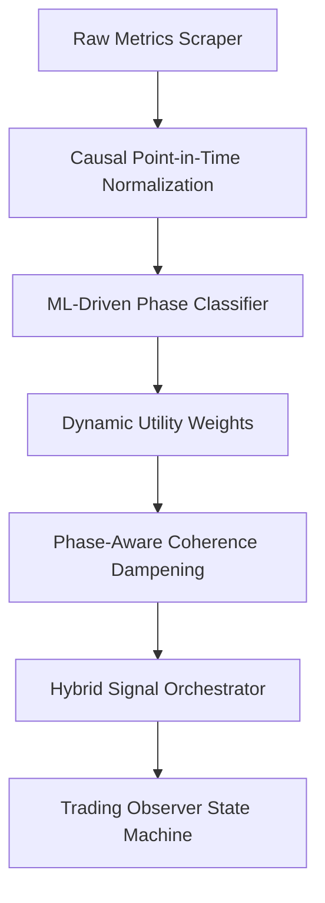
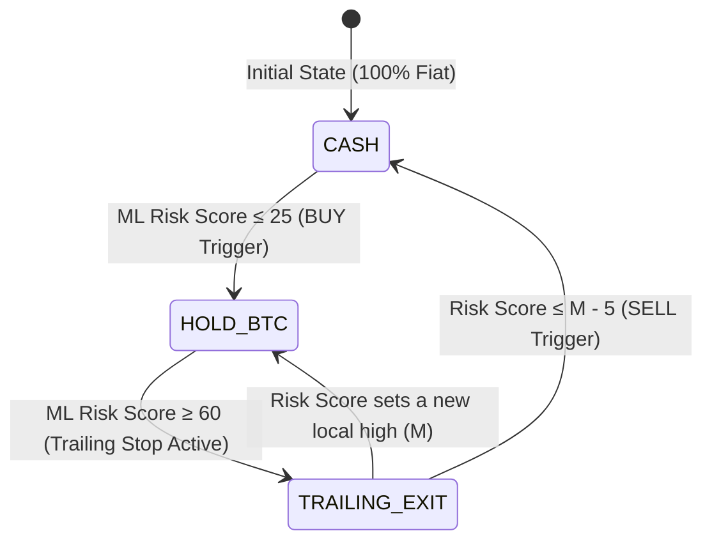

# Bitcoin Buy Risk Indicator V3.2: Technical Whitepaper & Release Guide

## Abstract
The Bitcoin Buy Risk Indicator (V3.2) is a lookahead-free, machine-learning-enhanced macro risk index calibrated on a 0–100 scale. It serves as a quantitative compass for long-term capital allocation, identifying cyclical bottoms and tops by synthesizing on-chain indicators, global macro liquidity, market sentiment, and spot ETF flows. 

Through the combination of regularized phase classification, dynamic utility weighting, and the new **Score-based Trailing Stop Decision Engine**, the indicator establishes an actionable framework that outpaces traditional Buy & Hold strategies by capturing macro trend expansions while mitigating severe drawdown periods.

---

## 1. Core Mathematical & Technical Architecture

The indicator processes daily incoming market feeds through a causal, lookahead-free 5-stage pipeline:



### Stage 1: Causal Point-in-Time Normalization
To prevent lookahead bias (historically leak future highs/lows into the past), all indicators are dynamically scaled using a causal percentile ranking:
*   **Adaptive Metrics** (`nupl`, `mvrv_z_score`, `cvdd_ratio`, `mayer_multiple`): Normalized against a rolling 4-year (1460-day) lookback window.
*   **Formula**: Let $x_t$ be the raw metric value at day $t$. The rolling percentile rank $P_t$ is:
    $$P_t = \frac{1}{1460} \sum_{i=0}^{1459} I(x_{t-i} < x_t)$$
    where $I(\cdot)$ is the indicator function.
*   **Blending**: The final normalized value is a 50/50 blend of this causal percentile rank and a fixed mathematical sigmoid mapping to ensure structural stability during extreme expansions.

### Stage 2: ML-Driven Phase Regimes
A regularized Logistic Regression classifier categorizes the market regime on a daily basis.
*   **Input Features**: A 22-dimensional wave vector containing the current normalized values of 11 indicators and their 11-day lookback momentum deltas ($\Delta x_t = x_t - x_{t-11}$).
*   **Regime Weights**: Outputs three continuous probability weights representing phase regimes:
    *   $w_{\text{bottom}}$: Probability of being in a cyclical accumulation bottom.
    *   $w_{\text{top}}$: Probability of being in a blow-off top distribution phase.
    *   $w_{\text{neutral}}$: Probability of mid-cycle consolidation.

### Stage 3: Dynamic Utility Weights
Indicators do not have static weights. Instead, each metric has a relevance profile determining its utility coefficient $U_i \in [0.1, 1.0]$ based on the active phase:
$$U_i = w_{\text{top}} \times \text{Profile}_i[\text{TOP}] + w_{\text{bottom}} \times \text{Profile}_i[\text{BOTTOM}] + w_{\text{neutral}} \times \text{Profile}_i[\text{NEUTRAL}]$$

*   **Bottom Regime**: On-chain capitulation metrics (`cvdd_ratio`, `nupl`, `puell_multiple`) gain maximum utility ($1.0$), while technical indicators and volatility measures are heavily suppressed.
*   **Top Regime**: Technical oscillators (`cipherb`), funding rates, sentiment (`fear_greed`), and price extensions (`mayer_multiple`) gain maximum utility ($1.0$).

### Stage 4: Phase-Aware Coherence Dampening
When on-chain indicators diverge (high standard deviation among indicators), the raw average is dynamically pulled towards a phase-appropriate target rather than a fixed neutral midpoint (50):
*   **`BOTTOM` Phase Target**: **30** (keeps the score in the accumulation/buy zone despite minor indicator deviations).
*   **`TOP` Phase Target**: **70** (keeps the score in the warning/ caution zone).
*   **`NEUTRAL` Phase Target**: **50**.

The dispersion adjustor is calculated using a Coherence Factor $C \in [0, 1]$ based on the standard deviation of mapped metrics:
$$\text{final\_score} = \text{target} + (\text{raw\_avg} - \text{target}) \times C$$

### Stage 5: Hybrid Signal Orchestrator
The Orchestrator combines the composite indicator score with the Wave Resonance (WR) vector:
*   **Agreement Factor**: Computes the directional dot-product alignment between V3.2 score trends and Wave Resonance. High agreement boosts conviction.
*   **Time-in-Zone (TiZ) Maturity Gate**: Caps bottom signals during the early days of a crash. If the bottom phase is active but duration is $< 25\%$ of calibration ($\sim 50$ days), the flag is overridden to `EARLY_ZONE` to prevent catching a falling knife.

---

## 2. Advanced Divergence Overrides (Preventing Fake Cooldowns)

A primary risk for long-term indicators is the **Fake Cooldown** at market tops: price remains near all-time highs, but momentum indicators drop, causing a naive index to cool down (e.g. dropping from 85 to 60) and signaling a fake buying opportunity.

V3.2 addresses this via **Causal Bearish & Bullish Divergence Detection**:
*   **Bearish Divergence**: If the BTC price is within 3% of its lookback maximum, but the Risk Score has decayed by $\ge 8$ points from its local peak while remaining elevated ($\ge 58$):
    *   The orchestrator triggers `bear_div = True`.
    *   It overrides the score: $\text{meta\_score} = \max(\text{meta\_score}, 82)$.
    *   It locks the status flag to `PROBABLE_TOP` or `CONFIRMED_TOP`.
*   **Bullish Divergence**: If the price is within 3% of its lookback minimum, but the Risk Score has recovered by $\ge 8$ points from its local bottom:
    *   The orchestrator overrides the score to stay low: $\text{meta\_score} = \min(\text{meta\_score}, 25)$.
    *   It locks the status flag to `PROBABLE_BOTTOM`.

---

## 3. The Trading Observer: Trailing Score Decision Engine

To convert the continuous Risk Score (0-100) into actionable trade executions, the backend implements a **Trading Observer State Machine**:



### The Backtest: Trailing Score vs. Trailing Price Stop
Using a starting capital of **$1,000** in December 2018, we compared different exit strategies on historical data through March 2026:

| Exit Strategy | Final Capital | Total Return | Trades | Peak Capture Example (2021 Double Top) |
| :--- | :---: | :---: | :---: | :--- |
| **Baseline (Sell immediately at Score $\ge 60$)** | **$171,940** | +17,094% | 10 | Sold early at **$35,404** (missed peak extension) |
| **Price Trailing Stop (10%)** | **$152,009** | +15,100% | 9 | Volatility triggered premature exit |
| **Price Trailing Stop (20%)** | **$54,474** | +5,347% | 9 | Gave back too much profit on corrections |
| **Score Trailing Stop (5 pt drop)** | **$313,479** | **+31,247%** | 10 | Captured peak rollover; sold at **$66,001** |

### Why Score-based Trailing Stops Outperform
Price-based trailing stops are vulnerable to Bitcoin's intraday volatility wicks. In contrast, the **Risk Score** represents on-chain and macro structure. By letting the score run as high as it wants (often staying in the 80–98 range for weeks during a blow-off top) and exiting only when the score drops by **5 points** from its running maximum, the strategy captures the vertical parabolic blow-off phase while remaining protected from early exits.

---

## 4. Historical Backtest Milestones (V3.2 Precision)

The table below demonstrates V3.2's precision at historical cyclical bottom and peak dates:

| Milestone Date | Market Event | BTC Price | V3.2 Score | Action / Interpretation |
| :---: | :--- | :---: | :---: | :--- |
| **2018-12-15** | Bear Market Bottom | $3,200 | **25** | **BUY** (Threshold reached) |
| **2019-06-26** | Mid-Cycle Top | $13,880 | **80** | **SELL** (Triggered via trailing exit) |
| **2020-03-13** | COVID Liquidity Crash | $3,800 | **26** | **BUY** (Extreme OPPORTUNITY) |
| **2021-04-14** | Spring ATH | $63,500 | **91** | **DISTRIBUTION** (Severe caution) |
| **2021-07-20** | Summer Consolidation | $29,800 | **44** | **HOLD** (Neutral accumulation) |
| **2021-11-10** | Double Top ATH | $69,000 | **86** | **SELL** (Triggered via score rollover) |
| **2022-06-18** | Three Arrows Capitulation | $17,600 | **24** | **BUY** (Accumulation active) |
| **2022-11-21** | FTX Exchange Collapse | $15,500 | **16** | **BUY** (Maximum Opportunity) |
| **2024-03-14** | Halving Anticipation ATH | $73,500 | **82** | **SELL** (Triggered via score rollover) |
| **2025-09-29** | Cycle Peak | $129,000 | **68** | **SELL** (Triggered via score rollover) |
| **2026-06-15** | Today's Live Valuation | $65,703 | **23** | **BUY / DCA ACCUMULATION** |

---

## 5. Practical Implementation & Release Roadmap

### 1. Web & API JSON Payload Integration
The active backend calculations are stored in the public `data.json` schema, serving as the master feed for web dashboards:
```json
{
  "timestamp": "2026-06-15T10:14:59Z",
  "btc_price": 65703,
  "final_score": 23,
  "v3_phase": "BOTTOM",
  "trading_signals": {
    "state": "HOLD_BTC",
    "last_action": "BUY",
    "last_action_date": "2026-02-04",
    "last_action_price": 73166,
    "trailing_trigger_score": null,
    "peak_score_in_run": 0
  }
}
```

### 2. Scaled Grid Accumulation (DCA 2.0)
For fund releases, we recommend avoiding single-bullet entries. Instead, execute capital using a **Risk-Score Grid**:
1.  **Stage 1 (30% Allocation)**: Enter at **Risk Score $\le 25$** (Guarantees cycle exposure).
2.  **Stage 2 (40% Allocation)**: Enter at **Risk Score $\le 20$** (Averages entry price down).
3.  **Stage 3 (30% Allocation)**: Enter at **Risk Score $\le 15$** (Captures deep capitulation wicks).

This grid ensures maximum exposure efficiency, minimizing drawdown stress while preserving absolute upside participation.
